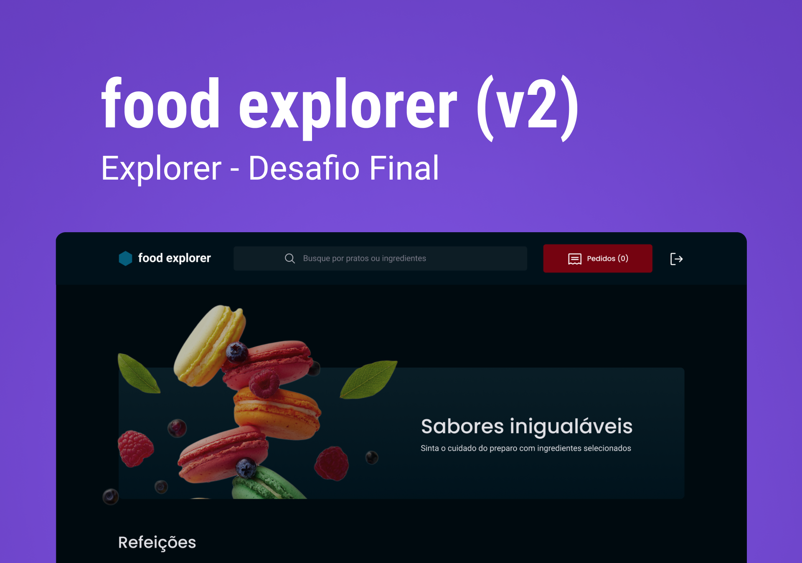

# FOOD EXPLORER

- A aplicação  é um cardápio digital para um restaurante fictício, conhecido como foodExplorer.

> Desafio Final - Explorer 



👉🏼[Link do projeto](https://ifood-explorer.netlify.app/)


### User adm
- Login: admin@email.com
- Password: 1234567


## Instalação

Instale com npm

```bash
  npm install 
```
    
## Deploy

Para fazer o deploy desse projeto rode

```bash
  npm run deploy
```


## Rodando localmente

Clone o projeto

```bash
  git clone https://github.com/Jose26362780/Front_End_food_explorer.git
```

Entre no diretório do projeto

```bash
  cd my-project git@github.com:Jose26362780/Front_End_food_explorer.git
```

Instale as dependências

```bash
  npm install
```

Inicie o servidor

```bash
  npm run dev 
```
## 🔗 LAYOUT DO PROJETO 💻

[[Figma]](https://www.figma.com/file/yGvQiqQYZPfcNRYolIgb1F/food-explorer-v2-(Community)?type=design&node-id=96-5219&mode=design&t=H0r2SbU0Ugm9Ls5j-0)


### 🛠 Technologies and Tools
Seguem as tecnologias e ferramentas utilizadas durante o projeto

- [HTML](https://developer.mozilla.org/pt-BR/docs/Web/HTML)

- [CSS](https://developer.mozilla.org/es/docs/Learn/Getting_started_with_the_web/CSS_basics)

- [Node.js](https://nodejs.org/en)

- [JavaScript](https://developer.mozilla.org/es/docs/Web/JavaScript)

- [React.js](https://pt-br.reactjs.org/)

- [React-Icons](https://react-icons.github.io/react-icons/)

- [Styled-Components](https://styled-components.com/)

- [Axios](https://axios-http.com/ptbr/docs/urlencoded)

- [BeekeeperStudio](https://www.beekeeperstudio.io/)


 - [Nodemon](https://www.npmjs.com/package/nodemon)


## 🔗 Observação 💻

 As vezes o carregamento da pagina pode demorar mas espere


## 🔗 Links de Contato 💻

[](https://www.linkedin.com/in/jose-martinez-352032222/)


- [Email] juniorjose1925@gmail.com


